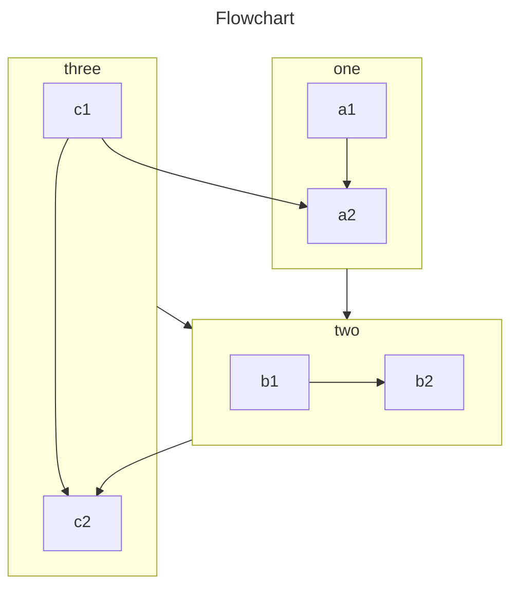

VuePress basically generate pages from Markdown files. So you can use it to generate documentation or blog sites easily.

You should create and write Markdown files, so that VuePress can convert them to different pages according to file structure.

<!-- more -->

## Markdown Introduction

If you are a new learner and don’t know how to write Markdown, please read [Markdown Intro](https://theme-hope.vuejs.press/cookbook/markdown/) and [Markdown Demo](https://theme-hope.vuejs.press/cookbook/markdown/demo.html).

## Markdown Config

VuePress introduce configuration for each Markdown page using Frontmatter.

::: info

Frontmatter is a important concept in VuePress. If you don’t know it, you need to read [Frontmatter Introduction](https://theme-hope.vuejs.press/cookbook/vuepress/page.html#front-matter).

:::

## Markdown Extension

The Markdown content in VuePress will be parsed by [markdown-it](https://github.com/markdown-it/markdown-it), which supports [syntax extensions](https://github.com/markdown-it/markdown-it#syntax-extensions) via markdown-it plugins.

### VuePress Enhancement

To enrich document writing, VuePress has extended Markdown syntax.

For these extensions, please read [Markdown extensions in VuePress](https://theme-hope.vuejs.press/basic/vuepress/markdown.html).

### Theme Enhancement

By using [`vuepress-plugin-md-enhance`][md-enhance], the theme extends more Markdown syntax and provides richer writing functions.

#### Custom Container

::: info Custom Title

A custom information container with `code`, [link](#custom-container).

```js
const a = 1;
```

:::

::: tip Custom Title

A custom tip container

:::

::: warning Custom Title

A custom warning container

:::

::: danger Custom Title

A custom danger container

:::

::: details Custom Title

A custom details container

:::

- [View Detail](https://theme-hope.vuejs.press/guide/markdown/container.html)

#### Tabs

::: tabs#fruit

@tab apple

Apple

@tab banana

Banana

@tab orange

Orange

:::

- [View Detail](https://theme-hope.vuejs.press/guide/markdown/tabs.html)

#### Superscript and Subscript

19^th^ H~2~O

- [View Detail](https://theme-hope.vuejs.press/guide/markdown/sup-sub.html)

#### 脚注

This text has footnote[^first].

[^first]: This is footnote content

- [View Detail](https://theme-hope.vuejs.press/guide/markdown/footnote.html)

#### Tasklist

- [x] Plan A
- [ ] Plan B

- [View Detail](https://theme-hope.vuejs.press/guide/markdown/tasklist.html)

#### Image Enhancement

Support setting color scheme and size

- [View Detail](https://theme-hope.vuejs.press/guide/markdown/image.html)

#### Echarts
::: details 一个基础南丁格尔玫瑰图案例
```md

::: echarts 一个基础南丁格尔玫瑰图案例

```json
{
  "legend": {
    "top": "bottom"
  },
  "toolbox": {
    "show": true,
    "feature": {
      "mark": {
        "show": true
      },
      "dataView": {
        "show": true,
        "readOnly": false
      },
      "restore": {
        "show": true
      },
      "saveAsImage": {
        "show": true
      }
    }
  },

```

:::

::: details 由于篇幅限制所以分段折叠这段长代码
```md
 "series": [
    {
      "name": "Nightingale Chart",
      "type": "pie",
      "radius": [20, 100],
      "center": ["50%", "50%"],
      "roseType": "area",
      "itemStyle": {
        "borderRadius": 8
      },
      "data": [
        {
          "value": 40,
          "name": "rose 1"
        },
        {
          "value": 38,
          "name": "rose 2"
        },
        {
          "value": 32,
          "name": "rose 3"
        },
        {
          "value": 30,
          "name": "rose 4"
        },
        {
          "value": 28,
          "name": "rose 5"
        },
        {
          "value": 26,
          "name": "rose 6"
        },
        {
          "value": 22,
          "name": "rose 7"
        },
        {
          "value": 18,
          "name": "rose 8"
        }
      ]
    }
  ]
}
```
:::

:::


::: echarts A line chart

```json
{
  "xAxis": {
    "type": "category",
    "data": ["Mon", "Tue", "Wed", "Thu", "Fri", "Sat", "Sun"]
  },
  "yAxis": {
    "type": "value"
  },
  "series": [
    {
      "data": [150, 230, 224, 218, 135, 147, 260],
      "type": "line"
    }
  ]
}
```

:::

- [View Detail](https://theme-hope.vuejs.press/guide/markdown/echarts.html)

::: echarts 一个柱状图案例

```json
{
  "xAxis": {
    "type": "category",
    "data": ["Mon", "Tue", "Wed", "Thu", "Fri", "Sat", "Sun"]
  },
  "yAxis": {
    "type": "value"
  },
  "series": [
    {
      "data": [120, 200, 150, 80, 70, 110, 130],
      "type": "bar",
      "showBackground": true,
      "backgroundStyle": {
        "color": "rgba(180, 180, 180, 0.2)"
      }
    }
  ]
}
```

:::

- [View Detail](https://theme-hope.vuejs.press/zh/guide/markdown/echarts.html#%E6%9F%B1%E7%8A%B6%E5%9B%BE)

::: echarts 一个散点图案例

```json
{
  "xAxis": {},
  "yAxis": {},
  "series": [
    {
      "symbolSize": 20,
      "data": [
        [10.0, 8.04],
        [8.07, 6.95],
        [13.0, 7.58],
        [9.05, 8.81],
        [11.0, 8.33],
        [14.0, 7.66],
        [13.4, 6.81],
        [10.0, 6.33],
        [14.0, 8.96],
        [12.5, 6.82],
        [9.15, 7.2],
        [11.5, 7.2],
        [3.03, 4.23],
        [12.2, 7.83],
        [2.02, 4.47],
        [1.05, 3.33],
        [4.05, 4.96],
        [6.03, 7.24],
        [12.0, 6.26],
        [12.0, 8.84],
        [7.08, 5.82],
        [5.02, 5.68]
      ],
      "type": "scatter"
    }
  ]
}
```

:::

- [View Detail](https://theme-hope.vuejs.press/zh/guide/markdown/echarts.html#%E6%95%A3%E7%82%B9%E5%9B%BE)

#### Mermaid
- [View Detail](https://theme-hope.vuejs.press/zh/guide/markdown/mermaid.html)



- [View Detail](https://theme-hope.vuejs.press/guide/markdown/mermaid.html)

#### Tex

$$
\frac {\partial^r} {\partial \omega^r} \left(\frac {y^{\omega}} {\omega}\right)
= \left(\frac {y^{\omega}} {\omega}\right) \left\{(\log y)^r + \sum_{i=1}^r \frac {(-1)^i r \cdots (r-i+1) (\log y)^{r-i}} {\omega^i} \right\}
$$

- [View Detail](https://theme-hope.vuejs.press/guide/markdown/tex.html)

#### 导入文件

<!-- @include: ./README.md{11-17} -->

- [View Detail](https://theme-hope.vuejs.press/guide/markdown/include.html)

#### Code Demo

::: normal-demo A normal demo

```html
<h1>VuePress Theme Hope</h1>
<p>Is <span id="very">very</span> powerful!</p>
```

```js
document.querySelector("#very").addEventListener("click", () => {
  alert("Very powerful!");
});
```

```css
span {
  color: red;
}
```

:::

- [View Detail](https://theme-hope.vuejs.press/guide/markdown/demo.html)


#### Vue Playground

::: vue-playground Vue Playground

@file App.vue

```vue
<script setup>
import { ref } from "vue";

const msg = ref("Hello World!");
</script>

<template>
  <h1>{{ msg }}</h1>
  <input v-model="msg" />
</template>
```

:::

- [View Detail](https://theme-hope.vuejs.press/guide/markdown/vue-playground.html)

#### Presentation

@slidestart

## Slide 1

A paragraph with some text and a [link](https://mrhope.site)

---

## Slide 2

- Item 1
- Item 2

---

## Slide 3.1

```js
const a = 1;
```

--

## Slide 3.2

$$
J(\theta_0,\theta_1) = \sum_{i=0}
$$

@slideend

- [View Detail](https://theme-hope.vuejs.press/guide/markdown/presentation.html)

[md-enhance]: https://md-enhance.vuejs.press/
