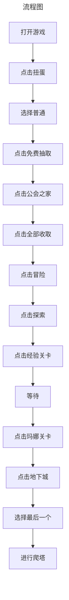

# 技术选型
开发游戏脚本实现懒人化操作，想要对一些频繁的操作添加自定义事件。  
目前合适的相关轮子有：
- [autojs](https://pro.autojs.org/docs/zh/guide/)
- 网易游戏的自动化测试项目[AirtestProject](https://airtest.doc.io.netease.com/)

优缺点比较：
略

# AirtestProject
AirtestProject是由网易游戏推出的UI自动化测试解决方案，其中包含了：
- Airtest框架
- Poco框架

项目基于基于Python，建议在使用前，先学习Python的基础语法知识。  

# 需求分析
## 流程

需求分析好了之后，现在开始脚本编写吧！

